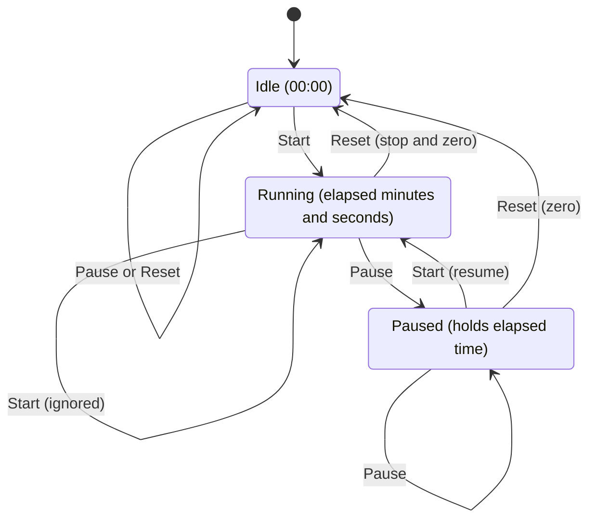

# test-devin
Use for testing with Devin

## Stopwatch states

Start, Pause, and Reset stay enabled in every state; press Start to resume from Paused.

```mermaid
stateDiagram-v2
    state "Idle (00:00)" as Idle
    state "Running (elapsed minutes and seconds)" as Running
    state "Paused (holds elapsed time)" as Paused

    [*] --> Idle

    Idle --> Running : Start
    Running --> Paused : Pause
    Paused --> Running : Start (resume)

    Idle --> Idle : Pause or Reset
    Running --> Running : Start (ignored)
    Paused --> Paused : Pause

    Running --> Idle : Reset (stop and zero)
    Paused --> Idle : Reset (zero)
```
